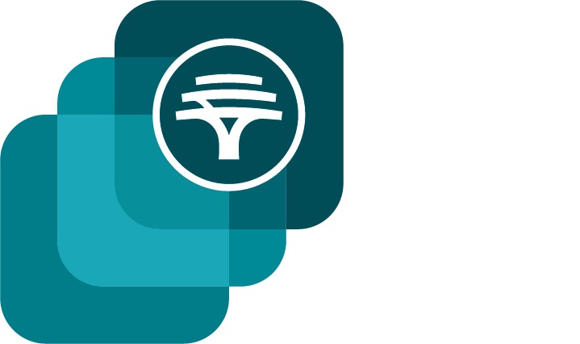

 
# FNB App Academy

Welcome to my repository for the **FNB App Academy**! This repo documents my journey as I progress through the 9-week training program focused on app development, design thinking, and real-world software engineering principles.

## 📚 Overview

The FNB App Academy is a learning experience designed to help participants grow their technical skills and understanding of digital banking solutions through practical projects and mentorship.

This repository contains:

* 📚 Curriculum
* 🛠️ Mini Projects and Assignments
* 🧠 Key Learnings & Concepts
* 💡  Improvements

## 🗂️ Repository Structure

```bash
fnb-app-academy/
├── week-1/
│   ├── index.html
│   ├── about.html
│   ├── boat.html
│   ├── images/
│   └── README.md
├── week-2/
│   ├── avengers/
│   ├── compukids-web/
│   └── README.md
├── week-3/
│   ├── pine-city-zoo/
│       ├── animals/
│       ├── images/
│       ├── places/
│       ├── animals.html
│       ├── feedback.html
│       ├── index.html
│       ├── message-received.html
│       ├── places.html
│       ├── style.css
│       └── weather.html
│   └── README.md
├── week-4/
│   ├── lesson-1/
│   ├── lesson-2/
│   ├── lesson-3/
│   ├── lesson-4/
│   ├── lesson-5/
│   ├── lesson-6/
│   ├── lesson-7/
│   ├── lesson-8/
│   ├── lesson-9/
│   ├── lesson-10/
│   ├── lesson-11/
│   ├── lesson-12/
│   ├── lesson-13/
│   ├── lesson-14/
│   ├── lesson-15/
│   └── README.md
├── week-5/
│   ├── calculator.html
│   ├── style.css
│   └── README.md
├── week-6/
│   ├── add-contact.html
│   ├── config.js
│   ├── edit-contact.html
│   ├── enter-api-key.html
│   ├── index.html
│   ├── script.js
│   ├── style.css
│   └── README.md
├── week-7/
│   ├── strings.py
│   ├── strings1.py
│   ├── python.py
│   ├── python1.py
│   ├── python2.py
│   ├── python3.py
│   ├── python4.py
│   ├── python5.py
│   ├── python6.py
│   ├── python7.py
│   └── README.md
├── week-8/
│   ├── dictionary.py
│   ├── dictionary1.py
│   ├── lists.py
│   ├── lists1.py
│   ├── sets.py
│   ├── shopping_cart.py
│   ├── shopping_cart_mod.py
│   ├── tuples.py
│   └── README.md
├── week-9/
└── README.md
```

## 🧾 Curriculum

### Beginner Level

* **Orientation**
  Introduction to the App Academy program and setup.

* **App Strategies (Platform, Native, etc)**
  Understanding different app approaches and choosing the right strategy.

* **GitHub and Collaboration**
  Using GitHub for version control and team collaboration.

* **Build an App with HTML (The SDLC)**
  Hands-on HTML project and introduction to the Software Development Life Cycle.

* **Principles of UX Design + Basic Layouts + Transitions**
  User experience fundamentals, layout design, and smooth UI transitions.

* **Feedback and Q\&A**
  Open session to ask questions and get clarity.

### Intermediate Level

* **Design Thinking**
  Exploring human-centered design methodologies.

* **APIs + Data Input + Processing**
  Introduction to APIs and data handling in apps.

* **User-Centric App Development**
  Building apps with a focus on user needs and usability.

* **Data Management and Analysis**
  Managing app data and performing basic analysis.

* **Business Development**
  Understanding app monetization and business planning.

* **Feedback and Q\&A**
  Open discussion and support session.

### Advanced Skills

* **Backend Development Intro**
  Introduction to backend concepts and server-side development.

* **Backend Development (Build an API)**
  Hands-on experience building a basic API.

* **AI in Development**
  Overview of how AI can be integrated into applications.

* **Business Funding**
  Learning about funding options and pitching your app.

* **Marketing your App Business**
  Strategies for promoting and growing your app business.

* **Feedback and Q\&A**
  Final questions and mentorship session.


## 🛠️ Technologies & Tools

* HTML, CSS, JavaScript.
* Git & GitHub.
* API Integration.
* Basic Backend (Node.js / Express).
* UI/UX Design Principles.
* Figma (for Prototyping).
* AI in Development.
* Business & Marketing Fundamentals.

## 🤝 Connect

If you’re also part of the App Academy or want to connect and collaborate, feel free to reach out!


📧[**linfordsnagger@gmail.com**](mailto:linfordsnagger@gmail.com)

---

**Note:** This repository is for learning purposes and may contain experimental code or concepts as I practice and grow my skills.

